# PowderMonkey Design

**Status:** working design draft (local-first v1 in progress)
**Audience:** single operator / builder
**Default operating mode:** Barrage
**Core philosophy:** anti-ticketing, pro-registration

**Stack:** Bun + Elysia (one server) · Mantine + Zustand (UI) · embedded Postgres (PGlite) + Drizzle — live tables as source of truth + an append-only action/diff log, Postgres-portable · `claude -p` workers in git worktrees · all in one Docker container.

---

## 1. Product Spine

PowderMonkey is a single-operator command center for running many `claude -p` workers at once.

It turns broad goals into reviewed plans, launches workers against bounded tasks, and lets live workstreams evolve through follow-up tasks, PRs, questions, and proposals.

> PowderMonkey is not Jira for agents. It is a high-throughput control plane for one operator with Claude, a dream, and too many useful workers to supervise by tabbing between chats.

### Purpose

PowderMonkey exists to make the current state of agent work externally visible and quickly legible:

- what is being worked on
- what is waiting for the operator
- what has produced a PR
- what needs review
- what has a specific question
- what can continue running
- what can be marked done

### Non-purpose

PowderMonkey should not:

- enforce responsibility on humans
- become a ticketing bureaucracy
- treat chat logs as canonical state
- claim files, modules, packages, or code areas
- turn plan-to-plan reasoning into Jira-style dependency management
- require the operator to tab through 50 chats and pr's to understand state

### Core Principle

PowderMonkey is **anti-ticketing but pro-registration**.

Workers must register what they are doing, but the system exists to accelerate execution, not to manage people.

---

## 2. Core Hierarchy

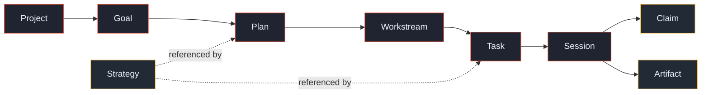

### Project

A long-lived product, codebase area, or operational domain — and the place that
holds **everything an agent needs to work on it**. A Project is the working
context a `claude -p` worker is dropped into, so it carries:

- **repo location** — where the code lives (a local path today; a remote/clone
  URL later)
- **path inside the repo** — the subdirectory to work in, so several Projects
  can share one monorepo while each scopes to a different area
- **secrets / login material** — the env vars, tokens, `.env` files, or service
  logins a worker needs so it lands in a ready-to-work environment instead of
  hitting auth walls

Projects are not the same thing as repositories. Two Projects can point at the
same monorepo but scope to different subpaths, with their own goals and secrets.

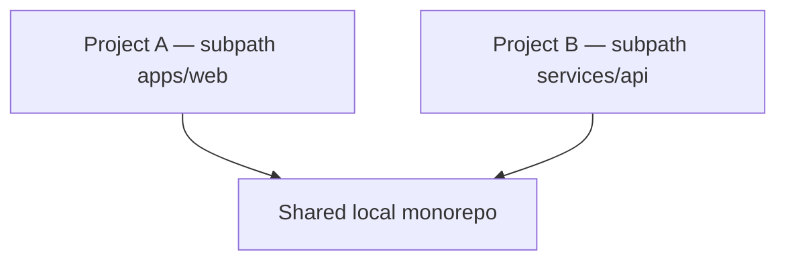

### Goal

A broad operator intent inside a Project.

Examples:

- Improve the editor UX
- Make the app more shareable
- Reduce Claude merge friction
- Prepare for public launch

A Project can have many Goals. A Goal can have many Plans attacking different aspects of it.

### Plan

A reviewable proposal for a Workstream.

A Plan contains Tasks, may reference Strategies, and must be reviewed before workers go out.

One Plan is always required to start a Workstream.

The Plan is important at the beginning, but it does not need to remain a perfect forever-updated mirror of reality.

### Workstream

A Plan in action.

The Workstream is the live execution context. It may diverge from the initial Plan and can accumulate follow-up Tasks as work develops.

A Workstream may contain:

- launched Tasks
- unlaunched Tasks
- follow-up Tasks
- existing Sessions
- PR artifacts
- questions
- plan proposals
- task proposals
- review requests
- human-execution requests

### Task

A bounded assignment with an `objective` field.

Tasks can be:

- planning
- implementation
- review
- investigation

A Task can be added to an existing Session if that Session already has useful context.

### Session

A `claude -p` execution context running in a git worktree.

One Session can crank through multiple Tasks when it makes sense.

The one-task-per-session rule is a launch default, not a hard ontology constraint.

A Session can produce many Artifacts.

### Claim

A worker's registration (via the worker API) that it is working on a Task.

Claims are task-level only.

Workers do **not** claim code.

### Artifact

A reference to output from a Session.

Artifact kinds include:

- pull request (a local branch + diff in v1)
- plan proposal
- task proposal
- investigation report
- question
- review request
- human-execution request

---

## 3. Resolved Design Decisions

### 3.1 Follow-up Tasks

A worker can propose follow-up Tasks.

After supervisor normalization and operator review, those Tasks can be added to the current Workstream and, when useful, reflected back into the Plan record.

### 3.2 Plan Required

Every Workstream starts from at least one reviewed Plan. The Plan is the initial dispatch proposal. The Workstream is what actually happens after launch.

### 3.3 Existing-session Follow-up

A follow-up should become a new Task attached to an existing Session when that Session already has the relevant context.

### 3.4 Multi-task Sessions

One Session can execute multiple sequential Tasks when it makes sense. The one-task-per-session rule is not absolute. It is a launch default.

### 3.5 Text Proposal to Typed Graph

Workers produce text-based Plan proposals (an artifact). The supervisor converts those proposals into typed events and shows the structured result to the operator for review.

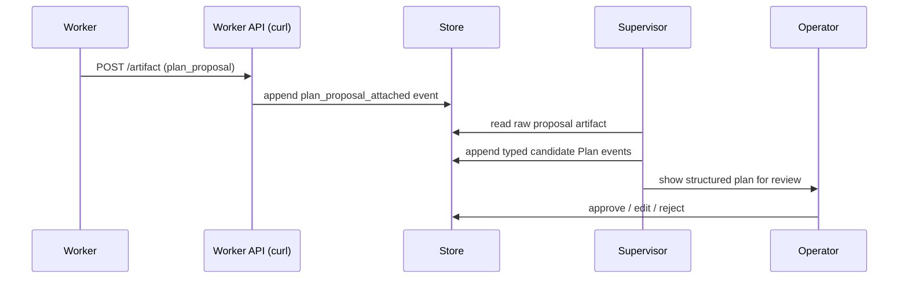

### 3.6 Task Ordering

Tasks can have ordering constraints. A DAG is acceptable where useful. Plan-to-plan dependency management should remain light to avoid Jira-style planning gravity.

### 3.7 Needs Input

A card moves to **Needs Input** (your ball) when:

- it needs review (a PR / artifact is ready)
- it has a specific question about what to do next

Answering and reviewing are the same kind of interruption, so they share one
board column. Once the operator approves, comments, or answers, the worker picks
that up (via its inbox / a `claude --continue` resume) and continues.

### 3.8 Commenting on Behalf of the Operator

If PowderMonkey comments on behalf of the operator, especially in response to automated review comments, it must indicate that in a standard, recognizable way.

Example marker:

```text
Commented via PowderMonkey on behalf of Zack.
```

### 3.9 Stale Detection

Stale detection is deferred.

### 3.10 No Worker CLI — a Self-describing API

Workers do **not** install a CLI. Each worker is handed a single token-scoped
URL; that endpoint describes itself (its task plus every action, each with a
ready-to-paste curl). See §10.

### 3.11 Claude Max via `claude -p`

Workers run as `claude -p` so they bill against the operator's Claude Max
subscription. This is the reason the orchestration layer is "just" a dispatcher
over the event log rather than an agent framework: a framework would
authenticate with a pay-per-token API key and defeat the point.

---

## 4. Plans, Workstreams, and Artifacts

### Plan

A Plan is the thing the operator reviews before workers go out. It is a structured proposal containing Tasks and perhaps Strategies. It exists to start the Workstream, not to become a perfect record of reality forever.

### Workstream

A Workstream is the living execution context after the Plan starts. It can:

- diverge from the original Plan
- absorb follow-up Tasks
- reuse existing Sessions
- accumulate Artifacts over time
- grow new branches of work based on worker proposals

### Plan as Artifact

A worker can be sent to produce a Plan. That output is a text-based Plan Proposal Artifact. The supervisor turns it into typed events for review and possible promotion.

### Many Proposals

A Task may produce any number of proposals. If a worker finds two valid paths to pursue later, both can be returned as Artifacts without forcing an immediate choice.

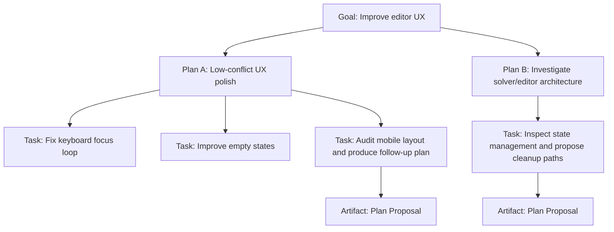

---

## 5. Strategies

Strategies are reusable static approaches. They are not active work and should not become a planning bureaucracy. Plans and Tasks can reference Strategies to inherit guidance.

### Low-conflict PR Strategy

Prefer isolated improvements, avoid broad rewrites, and produce small PRs that can land independently.

### Exploratory Planning Strategy

Inspect the repo, identify options, and return multiple proposed paths instead of implementing immediately.

### Test-first Cleanup Strategy

Start with tests or characterization before refactoring, then produce low-risk implementation PRs.

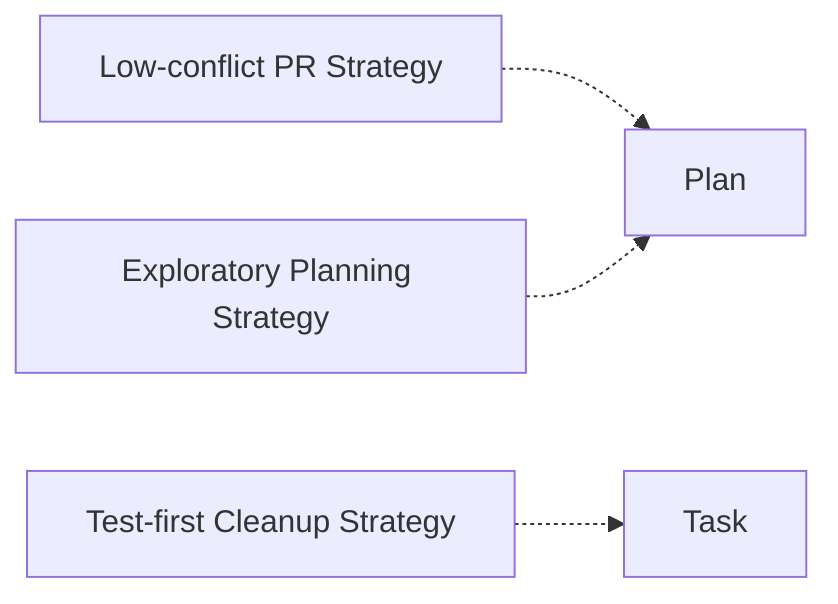

---

## 6. Default Workflow: Barrage

Barrage is not a special mode. It is how PowderMonkey works by default.

The operator gives a Goal, reviews a Plan, and then the Plan launches bounded Tasks into `claude -p` worker sessions.

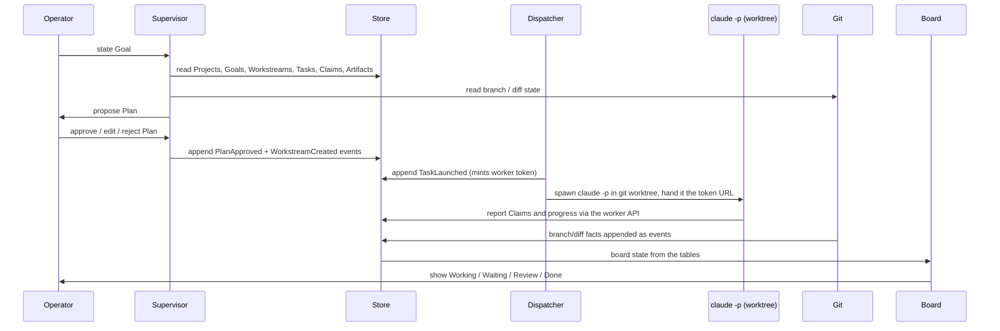

### Barrage Steps

1. Operator selects a Project and states a Goal.
2. Supervisor reads known Projects, Goals, active Workstreams, Tasks, Claims, Artifacts, and repo facts.
3. Supervisor proposes a Plan full of Tasks, optionally referencing Strategies.
4. Operator reviews, edits, approves, or rejects the Plan.
5. Approved Plan creates a Workstream.
6. The dispatcher launches Sessions for Tasks (a fresh git worktree + `claude -p` per task), or attaches follow-up Tasks to existing Sessions when context makes that better.
7. Each worker registers a task-level Claim through the worker API before working.
8. Workers push structured events only when something meaningful happens.
9. Git supplies branch/diff facts; GitHub (optional, later) supplies authoritative PR/CI facts.
10. Board state is derived from events.
11. Operator answers questions, reviews PRs, requests follow-ups, or marks Tasks/Plans/Goals done.

### Planning Tasks Are Normal Tasks

A Plan can contain implementation Tasks and planning Tasks together. Example:

- Task 1: fix known focus bug
- Task 2: improve empty state
- Task 3: investigate mobile layout and propose follow-up plan

---

## 7. Operator UI

The UI has multiple views over the same facts. The primary view is an attention board. The secondary view is the familiar session view, enriched with Project, Goal, Workstream, Task, Claim, Artifacts, PRs, and worker state.

### Attention Board

The board should show what the operator needs to care about. Healthy running work should be visually boring.

There are **three columns**, by whose ball it is:

- **Working** — the worker's ball. Includes CI failures and merge conflicts: the
  worker is expected to rebase/fix, so those stay here rather than getting their
  own column.
- **Needs Input** — your ball. A worker asked a specific question, or a PR /
  artifact is ready for review. (Answering and reviewing are the same kind of
  interruption, so they share one column.)
- **Done** — operator-marked terminal.

The richer underlying Task `status` (working, github_action, waiting_for_me,
needs_review, blocked, …) is still tracked and shown on each card's badge; the
three columns are just the attention buckets.

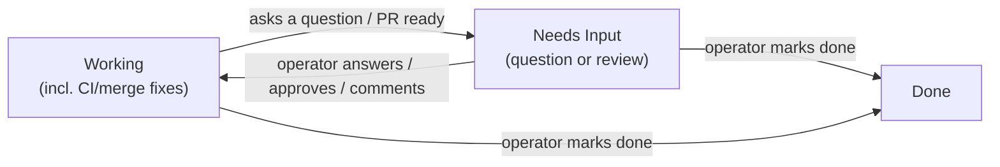

### Board Chat

A simple chat interface under the board can propose new Plans, new Tasks, follow-up Tasks for existing Sessions, movement of backlog items, review summaries, GitHub comment responses, and Workstream extensions.

Important mutations should be reviewed before they become canonical.

### Review Popups

Clicking a card that needs review should open the relevant context: Project, Goal, Plan, Workstream, Task objective, Session, Claim, PR (branch + diff), worker summary, proposal Artifacts, and available operator actions.

---

## 8. State and Source of Truth

### Store: live tables + an action log (embedded Postgres / PGlite)

A local **embedded Postgres** (PGlite) accessed through **Drizzle** holds the
state. The schema is Postgres dialect and migrations are generated by drizzle-kit
and applied at boot, so moving to a real Postgres later is just swapping the
client (no schema or query changes). Two layers:

- **Live entity tables — the source of truth.** `projects`, `goals`, `plans`,
  `workstreams`, `tasks`, `sessions`, `artifacts`, `claims`. Mutated CRUD-style
  (`UPDATE` a task's status directly); every row **soft-deletes** via `deleted_at`
  (nothing is ever hard-deleted). The board reads these tables directly.
- **`actions` — an append-only audit log.** Every mutation, in the same step,
  appends one `actions` row carrying the **field-level diff** (`{field:{from,to}}`)
  of the entity it changed, plus `actor`, `action`, `entity_type`, `entity_id`,
  `summary`, `seq`, `at`. Filter by `entity_id` to replay an entity's full
  history; read the stream for the activity feed. This is the history, not the
  source of truth.

It does not store full chat logs or code.

### Dispatcher (durable orchestration)

The dispatcher owns durable execution and resumption — there is no external
workflow engine. It can:

- launch a Task: create a worktree, mint a worker token, spawn `claude -p`
- on boot, query for Tasks that are launched-but-not-terminal and resume/relaunch them
- deliver operator answers/approvals back to a worker (a `claude --continue` resume)
- monitor running worker processes

Because the task rows are durable, recovery is just a query on startup: find the
in-flight tasks (status `launched`/`working` with a worktree) and re-attach.

### claude -p (worker execution)

`claude -p` owns the actual code-work execution context, running in a git
worktree on a task branch. It uses the operator's Claude Max subscription. Chat
logs are not read by default.

### Git / GitHub

Local **git** is authoritative for branch and diff reality. **GitHub** (optional
in v1) is authoritative for PRs, CI, mergeability, and merge state. If GitHub
says a PR is failing or conflicted, it is failing or conflicted, regardless of
what a worker claims.

### Truth Precedence

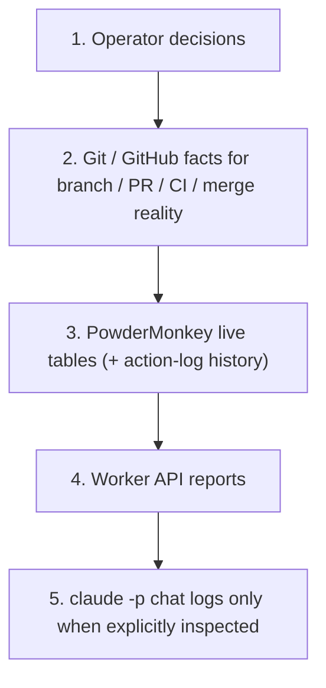

---

## 9. The Action Log

Mutations go through one repository layer: write the live row(s), then append one
`actions` row with the field-level diff — in the same step. So the truth (tables)
and the history (action log) never drift. Workers, the dispatcher, the supervisor,
and the operator all mutate through it.

Done is not inferred from a merged PR or from a worker saying it is done. Done is
a direct `UPDATE tasks SET status='done'` by the operator (logged as an action).

Action actors: `operator`, `supervisor`, `worker`, `github`, `dispatcher`, `system`.

```ts
type Action = {
  id: string
  seq: number          // monotonic order
  at: DateTime
  actor: Actor
  action: string       // e.g. task_launched, worker_requested_review, operator_answered
  entityType: string   // project | goal | plan | workstream | task | session | artifact | claim
  entityId: string
  summary?: string
  diff: Record<string, { from: unknown; to: unknown }>  // the before→after delta
}
```

A few example `action` values: `task_created`, `task_launched`, `claim_registered`,
`worker_progressed`, `worker_asked_question`, `artifact_attached`,
`worker_requested_review`, `operator_answered`, `operator_approved_review`,
`operator_marked_task_done`. (These name *what happened*; the `diff` records the
exact field changes.)

### Reads vs. history

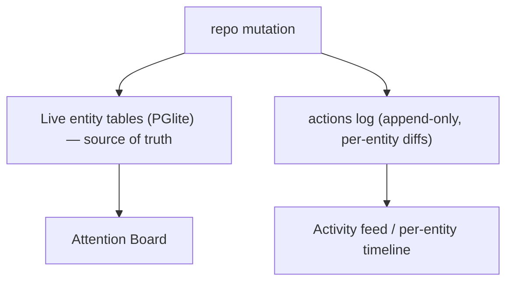

---

## 10. Worker API (self-describing, token-scoped)

Workers do not install a CLI. At launch the dispatcher mints an opaque **token**
and records it in the `TaskLaunched` event (so it is durable — rebuilt from the
log on boot). The worker is handed exactly one line in its prompt:

```text
For your task and how to report status: curl -s $BASE/api/w/$TOKEN
```

That endpoint **describes itself**: it returns the worker's task objective plus
an `actions` list — every GET and POST it can make, each with a `when` hint and
a ready-to-paste curl. There is nothing else to memorize and no extra LLM
polling cost.

### Reads (GET)

| Endpoint | Purpose |
|---|---|
| `GET /api/w/:token` | Self-description: the task + all available actions |
| `GET /api/w/:token/task` | The task objective and current status |
| `GET /api/w/:token/inbox?since=<seq>` | Operator answers / comments / approvals addressed to this task |

### Writes (POST → append an event)

| Endpoint | Body | Event appended |
|---|---|---|
| `POST /api/w/:token/claim` | `{summary}` | `ClaimRegistered` |
| `POST /api/w/:token/progress` | `{summary}` | `WorkerProgressed` |
| `POST /api/w/:token/question` | `{question}` | `WorkerAskedQuestion` → Waiting For Me |
| `POST /api/w/:token/artifact` | `{kind, summary, ref}` | `PullRequestAttached` / `PlanProposalAttached` / `TaskProposalAttached` / `ArtifactAttached` |
| `POST /api/w/:token/review` | `{summary}` | `WorkerRequestedReview` → Needs Review |
| `POST /api/w/:token/blocked` | `{reason}` | `WorkerMarkedBlocked` |

Example self-description (abridged):

```json
{
  "you_are": "a PowderMonkey worker. Report status by curling this API when something meaningful happens — do not poll in a loop.",
  "task": { "id": "task-1", "objective": "Fix the keyboard focus reset bug", "branch": "pm/task-1" },
  "actions": [
    { "name": "claim", "when": "first, before doing any work",
      "method": "POST",
      "curl": "curl -s -X POST $BASE/api/w/$TOKEN/claim -H 'content-type: application/json' -d '{\"summary\":\"<string>\"}'" }
  ],
  "next": "Start by POSTing a claim, then work the objective."
}
```

Auth in v1 is the opaque token in the path (sufficient for a localhost
single-operator tool; trivially swappable to a bearer header later).

---

## 11. Acting on Operator Feedback

### Review Feedback Loop

When the operator marks something approved, leaves comments, or answers a question, the relevant Session should pick that up (via its inbox) and continue.

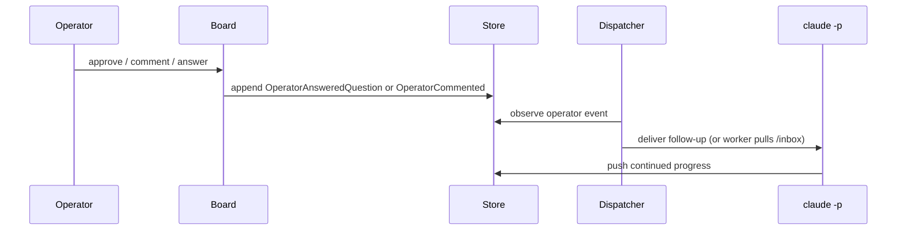

### Standard Comment Signature

If PowderMonkey comments on behalf of the operator, it should use a consistent marker, especially when responding to automated review or CI comments.

```text
Commented via PowderMonkey on behalf of Zack.
```

---

## 12. Locked Rules

### No Code Claims

Workers claim Tasks, not files, modules, packages, branches, or code areas.

### Duplicate Work

Duplicate work means materially the same Task objective inside the same Workstream. Same Goal elsewhere may warn but should not become Jira.

### No Default Chat-log Supervision

The supervisor does not read chat logs unless the operator asks. Board position is based on facts and pushed state.

### Questions Over Guessing

If uncertain, ask the operator unless explicitly told to explore further.

### Plans Are Starting Points

Plans are important to review before dispatch, but a live Workstream may diverge and accumulate follow-up Tasks.

### Light Ordering, Not Jira Gravity

Tasks may have ordering constraints, and a DAG is acceptable. Plan-to-plan planning should remain out of the core loop.

### Done Is Operator-marked

A Task, Plan, or Goal is not done just because a worker says it is done or a PR is merged. Done is when the operator marks it done.

---

## 13. Sketch Data Model

```ts
type Project = {
  id: string
  name: string
  repoPath: string          // where the code lives (local path today; clone URL later)
  subpath?: string          // path inside the repo to work in (for monorepos)
  secrets?: Record<string, string>  // env vars / tokens the worker needs
  envFiles?: string[]       // paths to .env-style files to load into the worker
  setup?: string            // optional shell to run before work (install deps, login)
}

type Goal = {
  id: string
  projectId: string
  title: string
  intent: string
  status: "active" | "done" | "abandoned"
}

type Strategy = {
  id: string
  projectId?: string
  name: string
  guidance: string
}

type Plan = {
  id: string
  goalId: string
  title: string
  summary: string
  strategyIds: string[]
  tasks: ProposedTask[]
  sourceArtifactId?: string
  status: "proposed" | "approved" | "rejected" | "promoted"
}

type Workstream = {
  id: string
  goalId: string
  startingPlanId: string
  title: string
  status: "active" | "waiting_for_me" | "done" | "abandoned"
}

type Task = {
  id: string
  workstreamId: string
  title: string
  objective: string
  kind: "planning" | "implementation" | "review" | "investigation"
  orderHint?: number
  afterTaskIds?: string[]   // simple DAG/order constraint where useful
  status:
    | "planned"
    | "launched"
    | "working"
    | "waiting_for_me"
    | "needs_review"
    | "github_action"
    | "done"
    | "abandoned"
    | "blocked"
  sessionId?: string
  branch?: string
  worktreePath?: string
}

type Session = {
  id: string
  workstreamId: string
  currentTaskId?: string
  taskIds: string[]
  status: "starting" | "working" | "waiting" | "stale" | "closed"
}

type Claim = {
  id: string
  taskId: string
  sessionId: string
  summary: string
}

type Artifact = {
  id: string
  taskId: string
  sessionId?: string
  kind:
    | "pull_request"
    | "plan_proposal"
    | "task_proposal"
    | "investigation_report"
    | "question"
    | "review_request"
    | "human_execution_request"
  payloadRef: string
}
```

---

## 14. Core Entity Relationship Diagram

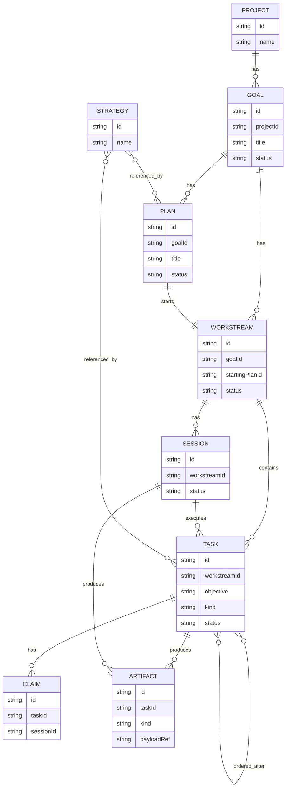

---

## 15. Implementation (as-built)

```
┌─────────────────────────────────────────────────────────────┐
│ one Bun + Elysia process                                     │
│                                                              │
│  Mantine SPA ──HTTP/WS──▶ Elysia ──▶ event log (PGlite)     │
│  (Zustand)                  │              (SoT, append-only) │
│                             ├─▶ board state (read model)│
│                             ├─▶ supervisor ─▶ claude -p (plan) │
│                             └─▶ dispatcher ─▶ claude -p        │
│                                   (durable)    in git worktree │
│                                                  │            │
│                  self-describing worker API ◀────┘            │
│                  (token curl, no CLI)                         │
└─────────────────────────────────────────────────────────────┘
```

### Stack

| Concern | Choice |
|---|---|
| Server | one Bun process running **Elysia** (REST + WebSocket + static SPA) |
| UI | **Mantine** components + **Zustand** store |
| Source of truth | **embedded Postgres (PGlite)** + Drizzle; Postgres-dialect schema, drizzle-kit migrations |
| Durable orchestration | a dispatcher rolled over the event log (no external engine) |
| Workers / supervisor | `claude -p` in `git worktree`s (Claude Max subscription) |
| Worker contract | self-describing token API (curl), no CLI |
| Packaging | one Docker container (planned) |

### Why no external workflow engine

Workers must be `claude -p` to use the Claude Max subscription (not a
pay-per-token API key), so the durable layer only needs to orchestrate
subprocesses — start them, survive restarts, resume on operator answers. That is
small enough to build directly on the task rows: their status is the durable
state, and recovery is just a query for in-flight tasks on boot.

### Worker spawn (login shell)

Workers and the supervisor are launched through a login shell
(`bash -lc 'claude -p "$PM_PROMPT" …'`). A bare `claude` spawn crashes — it
relies on environment the user's shell profile sets up — whereas the same command
via the login shell works. The prompt is passed via `$PM_PROMPT` to avoid
quoting/newline issues; the agent's cwd is the worktree narrowed to the Project
`subpath`, with Project secrets injected as env and `envFiles` sourced first.

### One repository, no drift

Every mutation goes through `repo.ts`: it writes the live row, computes the diff
versus the prior row, and appends the `actions` row — so the source of truth
(tables) and the history (action log) are written together and never diverge.
The board is a plain `SELECT` over the non-deleted rows (`getBoardState`); change
notifications over the WS feed tell the board to refetch. The server is the sole
writer, so it keeps a monotonic action `seq` in memory.

### Repo layout

```
drizzle/               drizzle-kit generated migrations (committed)
data/pgdata/           embedded Postgres (PGlite) data dir (gitignored)
src/
  shared/types.ts      entity + board-state shapes (server, web)
  server/
    schema.ts          Drizzle tables (Postgres dialect): live entities + actions log
    db.ts              PGlite + Drizzle: connection + migrate-on-boot
    repo.ts            CRUD + soft-delete; each mutation logs an action with the diff; getBoardState
    worker.ts          self-describing token API (/api/w/:token)
    backend.ts         WorkerBackend interface + LocalClaudeBackend (claude -p)
    dispatcher.ts      launch/worktree/spawn, boot+answer resume, plan approve, diff
    supervisor.ts      Goal → claude -p planning → proposed Plan
    index.ts           Elysia: REST + WS + static SPA (reference models + .group() routes)
  web/
    client.ts          Eden Treaty — type-safe client from the server's App type (no hand-written fetch)
    store.ts           Zustand; calls the treaty client; web/Board.tsx + ProjectFields for the UI
```

### Build status

| Piece | State |
|---|---|
| PGlite tables-as-truth + `actions` diff log (Drizzle migrations) | ✅ verified, persists across restart |
| Repository: CRUD + soft-delete + per-entity diff logging | ✅ |
| Elysia REST + WebSocket feed | ✅ verified |
| Self-describing token worker API (curl, no CLI) | ✅ full loop verified |
| Durable dispatcher + `claude -p` in git worktrees | ✅ verified with a **real** `claude -p` worker |
| Answer → resume loop (`claude --continue`) | ✅ real: question → answer → resume → done |
| Project context (subpath, secrets, env files, setup) | ✅ injected into worker + supervisor |
| Mantine + Zustand attention board (live over WS) | ✅ rendered + verified in-browser |
| Supervisor: Goal → plan → review → dispatch | ✅ verified (real plan + UI) |
| Diff view in review popup (branch diff + stat) | ✅ verified in-browser |
| Dockerfile (single container) | ⬜ next |

---

## 16. Remaining Open Questions

### Stale Detection

What are the exact stale-detection rules for long-running `claude -p` sessions? Deferred.

### Plan Proposal Review UI

Resolved (v1): a right-side **Plans** drawer lists proposed plans with their
tasks and Approve / Approve & launch / Reject. Open question is how this scales
when many plans are pending at once.

### Existing-session Task Display

How should Tasks attached to existing Sessions be displayed so the board remains clear?

### New Session vs Existing Session

How should the dispatcher decide between launching a new Session versus attaching a follow-up Task to an existing Session?

### Worktree Lifecycle

When is a task's git worktree created, reused, and cleaned up — and how does that interact with multi-task Sessions?

### Comment Signature

What exact standard marker should be used when PowderMonkey comments on behalf of the operator?

---

## 17. Current One-paragraph Summary

PowderMonkey organizes work as Project → Goal → Plan → Workstream → Task → Session. A Project is a long-lived product or codebase area that carries everything a worker needs — repo location, the subpath inside it, and any secrets or login material — so two Projects can share one monorepo yet scope to different areas. Goals are broad operator intents. Plans are reviewable dispatch proposals, often containing a barrage of Tasks and optional reusable Strategies. Every Workstream starts from a reviewed Plan, but the Workstream is the live execution context and may diverge as workers produce PRs, questions, reports, and follow-up proposals. Tasks have objectives; Objective is not a top-level noun. Workers run as `claude -p` in git worktrees (using the operator's Claude Max subscription), claim Tasks rather than code, and report progress by curling a self-describing token API — no CLI to install. A Session can execute multiple Tasks when it has useful context. Workers may produce text-based Plan or Task Proposals as Artifacts; the supervisor turns those into typed records for operator review. An embedded Postgres (PGlite, Drizzle-managed, Postgres-portable) holds the live entity tables as the source of truth — mutated CRUD-style with soft deletes — alongside an append-only action log that records every change's field-level diff; a dispatcher over the task rows handles durable execution and resumption, git/GitHub is authoritative for branch/PR reality, and the UI is an attention board plus chat-based control surface — one Bun + Elysia server, Mantine + Zustand front end, all in one container — for one operator trying to move as fast as possible.
